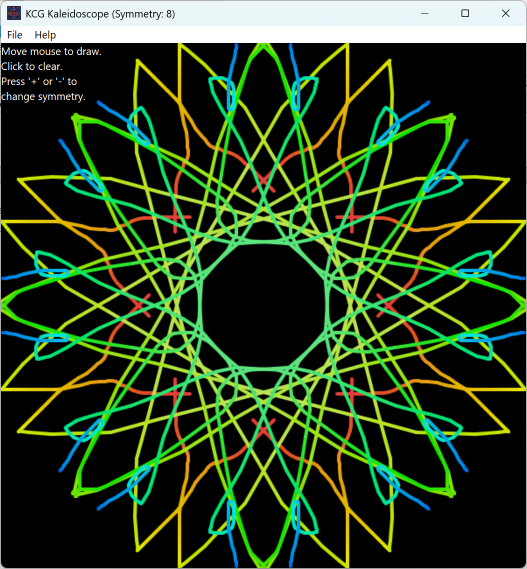

**KCG Kaleidoscope**  
Written By: Kevin Cary-Grimm

KCG Kaleidoscope is just what it says it is. It is an interactive kaleidoscope program for Windows, macOS, Linux, and Raspberry Pi. It is written in XOJO API 2.0. This is my first open source program on GitHub. It was written for fun and then was my GitHub learning project. The project’s source is out here as both the XOJO binary project and the XOJO XML project. Since different folks prefer different formats for different reasons.

You can download compiled program at my software website: <Http://KCG-Software.com>  
  
Screenshot  

-   This is the original project resubmitted to clean up the repository.
